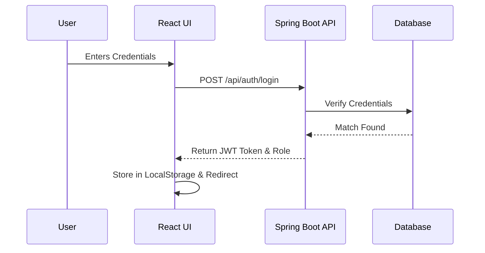

<div align="center">
  <h1>🎯 Full-Stack Interactive Quiz Application</h1>
  <p><i>A robust, modern, and highly scalable quiz platform built with React, Spring Boot, and MySQL.</i></p>

  
  
  
  
  
  <br />
  
  
  
</div>

<br />

> **Disclaimer**: This project was developed as a comprehensive academic submission demonstrating full-stack engineering, secure backend architectures, and modern UI/UX principles.

---

## 🚀 Live Demo & Deployment Links
Experience the live application right now!

* 🌐 **Live Website (Frontend)**: [https://quiz-app-fullstack-liard.vercel.app](https://quiz-app-fullstack-liard.vercel.app)
* ⚙️ **Live API (Backend)**: [https://quizapp-backend-04o9.onrender.com/api/admin/dashboard](https://quizapp-backend-04o9.onrender.com/api/admin/dashboard)
* 🗄️ **Database**: Hosted on Railway (MySQL)

**Test Credentials:**
* **Admin**: `admin` / `Admin@123`
* **User**: `user` / `User@123`

---

## 📑 Table of Contents
1. [Overview](#-overview)
2. [Core Features](#-core-features)
3. [Technology Stack](#-technology-stack)
4. [Methodology & Architecture](#-methodology--architecture)
5. [System Workflows](#-system-workflows)
6. [Database Schema](#-database-schema)
7. [API Documentation](#-api-documentation)
8. [Project Structure](#-project-structure)
9. [Local Installation Guide](#-local-installation-guide)
10. [Cloud Deployment Guide](#-cloud-deployment-guide)
11. [Screenshots](#-screenshots)
12. [Future Improvements](#-future-improvements)
13. [Author](#-author)
14. [License](#-license)

---

## 🌟 Overview
The **Interactive Quiz Application** is a full-stack solution designed to facilitate real-time examination and knowledge testing. It allows participants to log in and attempt dynamically served questions with a countdown timer, while simultaneously offering administrators a protected dashboard to manage the entire quiz repository (CRUD operations).

The project adopts a decoupled architecture, with a RESTful Spring Boot backend communicating via JSON payloads to a responsive, state-driven React.js frontend. 

---

## ✨ Core Features

### 👤 User Module (Participant)
* **Secure Login**: Access the portal using authenticated user credentials.
* **Dynamic Quiz Interface**: Questions are loaded seamlessly from the backend.
* **Real-time Timer**: A strict countdown timer (1 minute per question) is enforced. Auto-submits upon timeout.
* **Instant Evaluation**: Immediate calculation of scores upon submission.
* **Detailed Results**: Provides an exact percentage score, motivational messaging based on performance (e.g., Confetti animation for high scores), and a comprehensive breakdown of correct vs. incorrect answers.

### 👑 Admin Module (Instructor/Manager)
* **Protected Routes**: The entire admin dashboard is fortified via JWT (JSON Web Tokens) Authentication.
* **Dashboard Statistics**: View real-time metadata such as the total number of questions currently active in the database.
* **CRUD Capabilities**:
  * **Create**: Inject new multiple-choice questions into the database.
  * **Read**: Search and filter existing questions in real-time.
  * **Update**: Edit typos or change correct answers dynamically.
  * **Delete**: Remove outdated questions.

---

## 🛠️ Technology Stack

### Frontend Architecture
* **Library**: React.js (v19)
* **State Management**: React Hooks (`useState`, `useEffect`, `useCallback`)
* **Routing**: React Router DOM (v7)
* **Styling**: Vanilla CSS3 implementing a modern "Glassmorphism" UI design system.
* **Animations**: `react-confetti` for gamified user feedback.

### Backend Architecture
* **Framework**: Java Spring Boot (v3+)
* **Security**: Spring Security & JWT (io.jsonwebtoken) for stateless API authentication.
* **Data Access**: Spring Data JPA & Hibernate (ORM)
* **Build Tool**: Maven

### Database & Deployment
* **Database Engine**: MySQL 8.0
* **Containerization**: Docker (Multi-stage builds)
* **Cloud Hosting Platforms**: 
  * Frontend: Vercel
  * Backend: Render (Web Services)
  * Database: Railway

---

## 📐 Methodology & Architecture

The project follows the standard **Client-Server Architecture** employing the MVC (Model-View-Controller) design pattern on the backend, and a Component-Based architecture on the frontend.

### 1. Data Flow
1. **Client Request**: React frontend makes an asynchronous HTTP request using the `fetch` API.
2. **Security Check**: Requests directed to `/api/admin/**` are intercepted by the `JwtFilter`. The filter validates the Bearer token signed with the HMAC-SHA key.
3. **Controller Handling**: Spring Boot REST Controllers (`AuthController`, `QuizController`, `AdminController`) parse the JSON request.
4. **Service Layer**: Business logic (like calculating quiz scores) is executed here to keep controllers lean.
5. **Data Access**: The `QuestionRepository` utilizes JPA to perform SQL queries.
6. **Response**: Data is serialized back into JSON and served to the client.

### 2. Security Methodology
The application shifted from basic header-based role checking to **Stateless JWT Authentication**. When a user logs in, the `AuthController` issues a JWT valid for 24 hours. The frontend stores this token in `localStorage` and appends it to the `Authorization: Bearer <token>` header for all subsequent protected API calls.

---

## 🔄 System Workflows

### Authentication Flow


### Quiz Execution Flow
1. **Init**: User hits `/` route. Frontend fetches all active questions via `GET /api/quiz/questions`.
2. **Execution**: Frontend initializes the state array and starts the strict JS countdown timer. User selects options which are tracked in a dictionary state map.
3. **Submission**: User clicks submit, or timer expires. Frontend constructs a payload mapping `question_id` -> `selected_option`.
4. **Evaluation**: Payload is sent to `POST /api/quiz/submit`. Backend compares received options with the Database truth, calculates the raw score, and returns the metadata.

---

## 🗄️ Database Schema

The core of the application relies on a robust relational structure.

**Table: `questions`**
| Column Name      | Data Type    | Constraints                  | Description                         |
|------------------|--------------|------------------------------|-------------------------------------|
| `id`             | BIGINT       | PRIMARY KEY, AUTO_INCREMENT | Unique identifier for the question. |
| `question`       | VARCHAR(255) | NOT NULL                     | The actual quiz question text.      |
| `optionA`        | VARCHAR(255) | NOT NULL                     | First choice.                       |
| `optionB`        | VARCHAR(255) | NOT NULL                     | Second choice.                      |
| `optionC`        | VARCHAR(255) | NOT NULL                     | Third choice.                       |
| `optionD`        | VARCHAR(255) | NOT NULL                     | Fourth choice.                      |
| `correct_answer` | VARCHAR(1)   | NOT NULL                     | The correct option (A, B, C, or D). |

*(Users are currently authenticated via hardcoded static mock tables within the `AuthController` for demonstration purposes).*

---

## 🔌 API Documentation

### Public / User Endpoints
| Method | Endpoint | Description | Auth Required |
|--------|----------|-------------|---------------|
| `POST` | `/api/auth/login` | Authenticate and receive JWT | ❌ No |
| `GET`  | `/api/quiz/questions` | Fetch all questions | ❌ No |
| `POST` | `/api/quiz/submit` | Submit answers and get score | ❌ No |

### Protected / Admin Endpoints
| Method | Endpoint | Description | Auth Required |
|--------|----------|-------------|---------------|
| `GET`  | `/api/admin/questions` | View all questions | ✅ Yes (JWT) |
| `POST` | `/api/admin/add` | Add a new question | ✅ Yes (JWT) |
| `PUT`  | `/api/admin/update/{id}`| Update an existing question | ✅ Yes (JWT) |
| `DELETE`| `/api/admin/delete/{id}`| Remove a question | ✅ Yes (JWT) |
| `GET`  | `/api/quiz/stats` | Get dashboard statistics | ✅ Yes (JWT) |

---

## 📂 Project Structure

```text
quiz-app-fullstack/
│
├── backend/quizapp-backend/       # Spring Boot Application
│   ├── src/main/java/com/quizapp/backend/
│   │   ├── config/                # Security & JWT configurations
│   │   ├── controller/            # REST API endpoints (Admin, Auth, Quiz)
│   │   ├── model/                 # JPA Entities (Question)
│   │   ├── repository/            # Data Access Layer interfaces
│   │   └── service/               # Business Logic implementation
│   ├── src/main/resources/
│   │   └── application.properties # Database & Port configurations
│   ├── Dockerfile                 # Containerization instructions
│   └── pom.xml                    # Maven dependencies
│
├── frontend/                      # React Application
│   ├── public/                    # Static assets
│   ├── src/
│   │   ├── components/            # Reusable UI parts (Navbar, Buttons)
│   │   ├── pages/                 # Main Views (Login, Quiz, Admin, Result)
│   │   ├── services/              # API interceptors and fetch logic (api.js)
│   │   ├── index.css              # Global styles & Glassmorphism UI
│   │   └── App.js                 # React Router configuration
│   ├── package.json               # Node dependencies
│   └── vercel.json                # Vercel deployment routing rules
│
├── database/
│   └── schema.sql                 # Initial SQL Table structures
│
└── README.md                      # You are here
```

---

## 💻 Local Installation Guide

### Prerequisites
* Java 17+
* Maven 3.8+
* Node.js 18+ & npm
* MySQL 8.0+

### Step 0: Clone the Repository
Open your terminal and clone the repository to your local machine:
```bash
git clone https://github.com/Ganesh40292/quiz-app-fullstack.git
cd quiz-app-fullstack
```

### Step 1: Database Setup
1. Open MySQL Workbench or your CLI.
2. Run the following command: `CREATE DATABASE quizdb;`
3. Execute the SQL script located at `database/schema.sql` to generate the required tables.

### Step 2: Backend Setup
1. Navigate to the backend directory:
   ```bash
   cd backend/quizapp-backend
   ```
2. Verify `application.properties` matches your local MySQL credentials (`root` / `password`).
3. Run the application:
   ```bash
   mvn spring-boot:run
   ```
   *The server will start on `http://localhost:8080`.*

### Step 3: Frontend Setup
1. Open a new terminal and navigate to the frontend:
   ```bash
   cd frontend
   ```
2. Install the required NPM packages:
   ```bash
   npm install
   ```
3. Start the React development server:
   ```bash
   npm start
   ```
   *The client will start on `http://localhost:3000`.*

---

## 🐳 Docker Deployment (Backend)

For simplified deployments, the backend is fully containerized.
1. Build the Docker Image:
   ```bash
   cd backend/quizapp-backend
   docker build -t quizapp-backend .
   ```
2. Run the Container:
   ```bash
   docker run -p 8080:8080 -e DB_URL=jdbc:mysql://host.docker.internal:3306/quizdb -e DB_USERNAME=root -e DB_PASSWORD=yourpassword quizapp-backend
   ```

---

## ☁️ Cloud Deployment Guide

This project is configured to be seamlessly deployed across modern cloud providers.

### 1. Database (Railway)
* Provision a new MySQL Database on Railway.
* Note down the `MYSQL_URL`, `MYSQLUSER`, and `MYSQLPASSWORD`.
* Execute the `database/schema.sql` using Railway's integrated Data explorer.

### 2. Backend (Render)
* Create a new Web Service on Render linked to this GitHub repository.
* Set the Root Directory to `backend/quizapp-backend`.
* Render will automatically use the provided `Dockerfile`.
* Inject the following Environment Variables:
  * `DB_URL` (format: `jdbc:mysql://<railway-host>:<port>/railway`)
  * `DB_USERNAME`
  * `DB_PASSWORD`
  * `PORT` (set to `8080`)

### 3. Frontend (Vercel)
* Import the repository to Vercel.
* Set the Root Directory to `frontend`.
* Add the Environment Variable:
  * `REACT_APP_API_URL` (Set this to your live Render backend URL, e.g., `https://quiz-api.onrender.com/api`).
* Vercel will automatically read the `vercel.json` file to prevent client-side routing 404 errors.

---

## 📸 Screenshots

*(Replace the placeholder links below with actual image paths once deployed!)*

<details>
  <summary><b>1. Login Authentication Portal</b></summary>
  <br>
  
</details>

<details>
  <summary><b>2. Interactive Quiz Interface & Timer</b></summary>
  <br>
  
</details>

<details>
  <summary><b>3. Admin Dashboard & CRUD Operations</b></summary>
  <br>
  
</details>

<details>
  <summary><b>4. Real-time Results & Gamification</b></summary>
  <br>
  
</details>

---

## 🚀 Future Improvements

While this project covers full-stack fundamentals, several enhancements are planned for v2.0:
1. **Database-Driven User Registration**: Transition from hardcoded mock users in the `AuthController` to a fully functioning `users` table allowing anyone to sign up.
2. **Password Encryption**: Implement BCrypt hashing for storing user credentials securely.
3. **Competitive Leaderboard**: Aggregate high scores globally and display a top 10 leaderboard using optimized SQL queries.
4. **Pagination**: Implement server-side pagination for the admin dashboard when the question bank exceeds 100 entries.
5. **Question Categories**: Add a `category` and `difficulty_level` column to dynamically generate quizzes based on user preferences.

---

## 👨‍💻 Author

**Ganesh Prasad**  
*Computer Science & Engineering Student*  
Passionate about building scalable backend systems, interactive web applications, and constantly exploring modern software architecture.

* [GitHub Profile](https://github.com/Ganesh40292)
* [LinkedIn](#) *(Add your link here)*

---

## 📄 License

This project is licensed under the **MIT License**. 

You are free to use, modify, and distribute this project for academic, personal, or commercial use, provided that proper credit is given to the original author.

---
<p align="center">
  <i>If you found this project helpful, please consider giving it a ⭐ on GitHub!</i>
</p>
